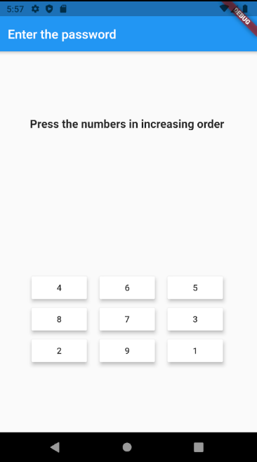
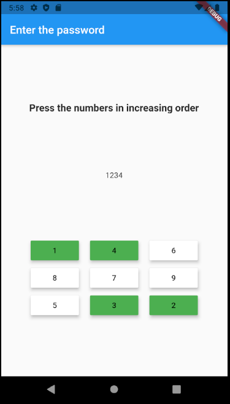
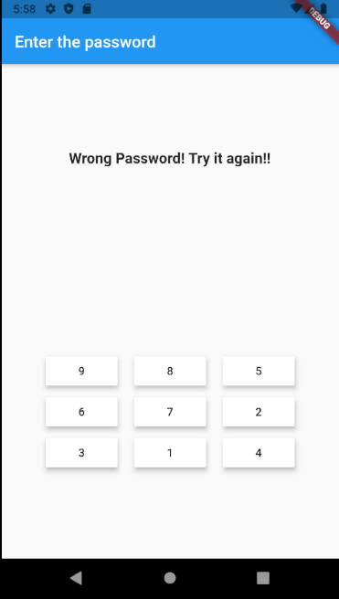
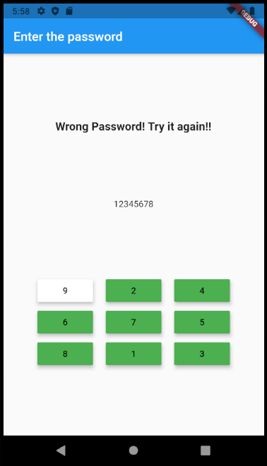
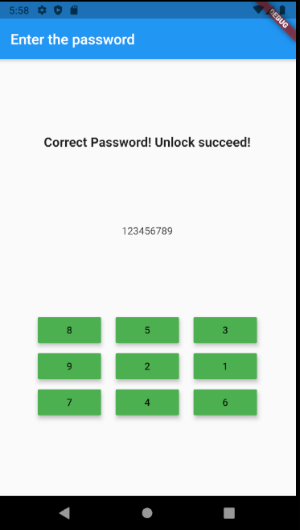

# First_week - Lockscreen Implementation  

The first assignment of our [flutter-study](https://github.com/shp7724/flutter-study)
- [The assignment instruction](https://www.notion.so/1-5e902b5f0cb64643a25b8fe265c18a92)

## [Main.dart](https://github.com/shp7724/flutter-study/blob/master/wonhyeon/first_week/lib/main.dart)  

My main.dart consists of two parts : 'appBar' and 'body'.
- 'appBar' is just the message of string, directing users to press the password.
- 'body' is the 'PasswordController' which controls whole functionalities of this app. (defined in 'widgets/password_controller.dart)

### [Password Controller](https://github.com/shp7724/flutter-study/blob/master/wonhyeon/first_week/lib/widgets/password_controller.dart)  

#### Structure  
The stateful widget that controls whole functionalities of this app.
This consists of the state + column of 3 stateless widgets.
State change only occurs when user press the one of 9 buttons, and the changed state modify the stateless widgets accordingly.

The state of this widget consists of:
- List \<NumberButtons\> _buttons : list of buttons. (The new class 'NumberButtons' is defined at [models/number_buttons.dart](https://github.com/shp7724/flutter-study/blob/master/wonhyeon/first_week/lib/models/number_buttons.dart))
- int _stateMessageIndex : The index for the appropriate state message.
- int _passwordChecker   : The desired single-digit input. Each user input is considered true if it is identical to this variable.
- String _passwordString : The user-pressed password to be displayed.

This widget is a column of:
- StateMessage ([widgets/state_message.dart](https://github.com/shp7724/flutter-study/blob/master/wonhyeon/first_week/lib/widgets/state_message.dart)) : The state message indicating whether the user has correctly entered the password. 
- PasswordDisplay([widgets/password_display.dart](https://github.com/shp7724/flutter-study/blob/master/wonhyeon/first_week/lib/widgets/password_display.dart)) : The widget that displays the user-entered password after every button press. Flushed when user enter the wrong password.
- ButtonPad ([widgets/button_pad.dart](https://github.com/shp7724/flutter-study/blob/master/wonhyeon/first_week/lib/widgets/button_pad.dart)) : The actual button pad that takes input from the user.

#### Control Flow  
Initial state is as follows:
- _buttons == List of 9 white buttons whose number is 1~9 respectively.
- _stateMessageIndex == 0 (Corrosponding to the string 'Press the numbers in increasing order')
- _passwordChecker == 1
- _passwordString == '' (empty String)

When the user press the button, following happens:
- Compare _passwordChecker and the value of pressed button.
  - If they are same: 
    - Change the color of the corrosponding button to green.
    - Update _passwordString by appending user-entered digit.
    - _passwordChecker++;
    - If the user-entered value is 9 (correct password), then _stateMessageIndex = 2 (Corrosponding to the string 'Correct Password! Unlock succeed!')

  - If they are different:
    - _stateMessageIndex = 1 (Corrosponding to the string 'Wrong Password! Try it again!!')
    - Initialize all other states.

#### Screenshots  
The initial UI:

When the user enter the password by pressing each button:

When the user pressed wrong button:

When the user retries after the error:

When the user entered correct password:

#### Developer  
[WonHyeon Kim](https://github.com/dnjsgus)

